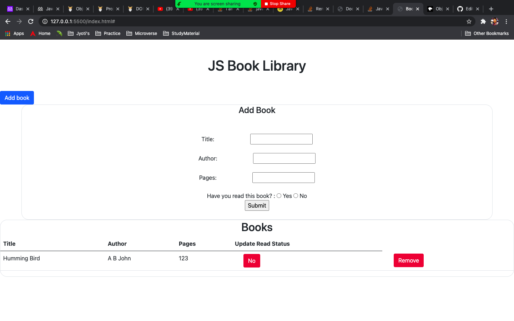

# Book Library

> In this project, we have built a book library application where user can add book, remove book and update the read status of book.

## Set Up Project Locally

**To get this project set up on your local machine, follow these simple steps:**

**Step 1** 
Navigate through the local folder where you want to clone the repository and run 
`git@github.com:jrai0792/Book-library.git` to clone the repo to your local folder. 
or with https 
`https://github.com/jrai0792/Book-library.git`. 
**Step 2** 
Run `cd Book-library` 

## Built With

- Javascript
- HTML
- Bootstrap
- VScode

## Live Demo

[Live Demo Link](http://127.0.0.1:5500/index.html#)

## Authors

👤 **Jyoti Rai**

- GitHub: [@githubhandle](https://github.com/jrai0792)

👤 **Sajjad Ahmad**

- GitHub: [@githubhandle](https://github.com/SajjadAhmad14)
- Twitter: [@twitterhandle](https://twitter.com/Sajjad_Ahmad14)
- LinkedIn: [LinkedIn](https://www.linkedin.com/in/sajjadahmad14)

## 🤝 Contributing

Contributions, issues, and feature requests are welcome!

Feel free to check the [issues page](https://github.com/jrai0792/Book-library/issues).

## Show your support

Give a ⭐️ if you like this project!

## 📝 License

This project is [MIT](lic.url) licensed.